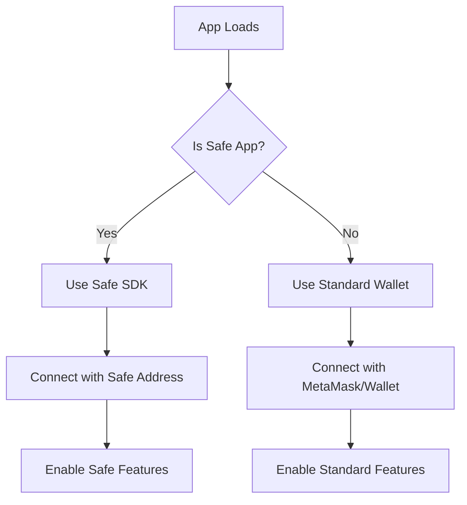
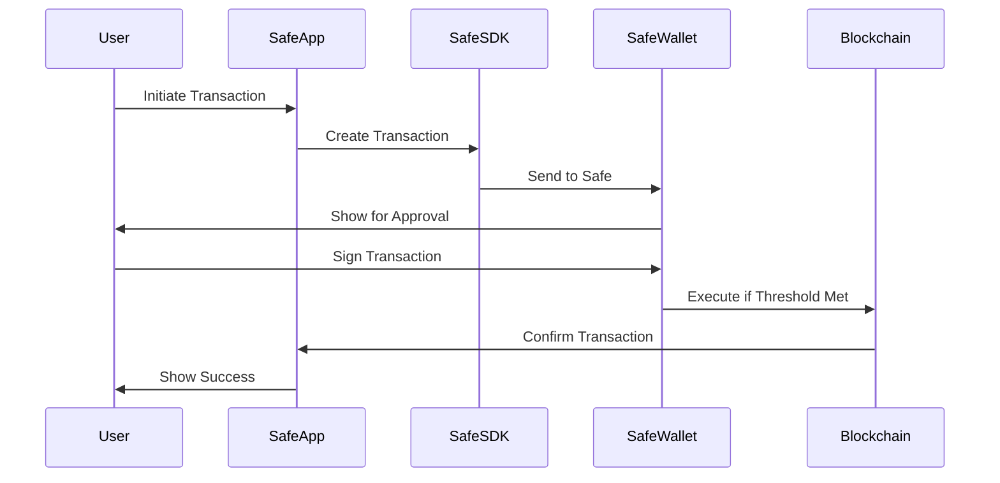

# Safe App Integration Guide

## Overview

Eagle Omnichain Vault is now a **Safe App**, enabling seamless integration with Safe (formerly Gnosis Safe) multisig wallets. This allows users to interact with the vault directly from the Safe interface.

## Features

### ✅ What's Integrated

- **Automatic Safe Detection**: App automatically detects when running inside a Safe iframe
- **Safe-Aware Wallet Connection**: Uses Safe SDK when running as Safe App, falls back to standard wallet connection otherwise
- **Admin Controls**: Multisig admin can execute capital injections directly through Safe
- **Full Functionality**: All vault features (deposit, withdraw, wrap, unwrap) work within Safe
- **Dual Mode Support**: Works as both standalone app and Safe App

### 🔐 Security Benefits

- **Multi-signature Approvals**: All admin actions require multisig approval
- **Transaction Simulation**: Safe's transaction simulation before execution
- **Transparent Operations**: All transactions visible to all signers
- **No Private Key Exposure**: Transactions signed through Safe's secure interface

## Technical Implementation

### Files Added

```
frontend/
├── src/
│   ├── components/
│   │   └── SafeProvider.tsx           # Safe Apps SDK context provider
│   ├── hooks/
│   │   └── useSafeApp.ts             # Hook for Safe App detection and functionality
│   └── App.tsx                        # Updated with Safe integration
└── public/
    └── manifest.json                  # Safe App manifest file
```

### Key Dependencies

```json
{
  "@safe-global/safe-apps-react-sdk": "^4.x",
  "@safe-global/safe-apps-sdk": "^9.x",
  "@safe-global/safe-apps-provider": "^0.x"
}
```

### Safe App Manifest

Located at `/public/manifest.json`:

```json
{
  "name": "Eagle Omnichain Vault",
  "description": "Dual-token yield vault accepting WLFI and USD1...",
  "iconPath": "eagle-logo.svg",
  "providedBy": {
    "name": "Eagle Protocol",
    "url": "https://eagle-vault.vercel.app"
  },
  "version": "1.0.0",
  "chain_ids": [1]
}
```

## Testing Your Safe App

### Local Testing

1. **Start Development Server**:
   ```bash
   cd frontend
   npm run dev
   ```

2. **Use Safe Apps Interface**:
   - Go to https://app.safe.global/
   - Connect your Safe
   - Navigate to "Apps" → "Custom Apps"
   - Enter: `http://localhost:5173`
   - Load the app

### Production Testing

- Use the production URL in Safe's Custom Apps:
  ```
  https://eagle-vault.vercel.app
  ```

## Registering in Safe Apps Directory

### Prerequisites

- ✅ Deployed production app
- ✅ Valid manifest.json
- ✅ Logo/icon assets (SVG or PNG, 512x512 recommended)
- ✅ Tested in Safe interface
- ✅ Documentation ready

### Registration Process

#### Option 1: Official Safe Apps Registry (Recommended)

1. **Fork the Safe Apps Repository**:
   ```bash
   git clone https://github.com/safe-global/safe-apps-sdk.git
   cd safe-apps-sdk
   ```

2. **Create a Pull Request** with your app info:
   - Repository: https://github.com/safe-global/safe-apps-sdk
   - Location: `/safe-apps-list/apps/`
   - Required files:
     - `logo.svg` or `logo.png`
     - `manifest.json`
     - `README.md` (optional but recommended)

3. **Submit App Information**:
   ```json
   {
     "id": "eagle-omnichain-vault",
     "url": "https://eagle-vault.vercel.app",
     "name": "Eagle Omnichain Vault",
     "description": "Dual-token yield vault with LayerZero omnichain capabilities",
     "networks": [1],
     "tags": ["defi", "vault", "yield", "omnichain"]
   }
   ```

4. **Wait for Review**: Safe team will review and approve your app

#### Option 2: Custom App URL (Immediate)

Users can add your app immediately using the Custom Apps feature:

1. Go to Safe → Apps → "Add Custom App"
2. Enter URL: `https://eagle-vault.vercel.app`
3. App loads directly in Safe interface

### Post-Registration

1. **Add Safe Badge** to your website:
   ```html
   <a href="https://app.safe.global/apps/open?safe=eth:YOUR_SAFE_ADDRESS&appUrl=https://eagle-vault.vercel.app">
     
   </a>
   ```

2. **Update Documentation**:
   - Add Safe App instructions to README
   - Create user guide for Safe users
   - Document admin workflows

3. **Promote Integration**:
   - Announce on Twitter/social media
   - Share with Safe community
   - Add to project documentation

## Safe App Features in Eagle Vault

### For Regular Users

- **Deposit WLFI/USD1**: Deposit tokens through Safe's multi-sig approval
- **Withdraw vEAGLE**: Redeem shares with multi-sig security
- **Wrap/Unwrap**: Convert between vault shares and OFT tokens
- **View Stats**: Real-time vault analytics and APY

### For Admins (Multisig)

- **Capital Injection**: Inject capital to boost share value
  - Requires multi-sig approval
  - Preview impact before execution
  - Full transparency to all signers
- **Strategy Management**: Future feature for strategy allocation
- **Emergency Actions**: Pause/unpause with multi-sig approval

## Architecture

### Safe App Detection Flow



### Transaction Flow in Safe



## Troubleshooting

### Common Issues

1. **App not loading in Safe**:
   - Check CORS settings
   - Verify manifest.json is accessible
   - Ensure HTTPS for production

2. **Transactions failing**:
   - Verify Safe has sufficient threshold signatures
   - Check token approvals
   - Confirm correct network (Ethereum mainnet)

3. **Provider errors**:
   - Ensure Safe Apps SDK is properly initialized
   - Check that SafeProvider wraps the app
   - Verify Safe SDK version compatibility

### Debug Mode

Enable debug logging by setting in `.env`:
```
VITE_SAFE_DEBUG=true
```

## Resources

- **Safe Apps SDK**: https://github.com/safe-global/safe-apps-sdk
- **Safe Apps Documentation**: https://docs.safe.global/safe-core-aa-sdk/safe-apps
- **Safe Apps Directory**: https://app.safe.global/apps
- **Safe Developer Portal**: https://docs.safe.global/

## Support

For Safe App-specific issues:
- GitHub Issues: https://github.com/wenakita/EagleOVaultV2/issues
- Telegram: https://t.me/Eagle_community_47
- Twitter: https://x.com/EagleProtocol

For Safe platform issues:
- Safe Discord: https://chat.safe.global
- Safe GitHub: https://github.com/safe-global

